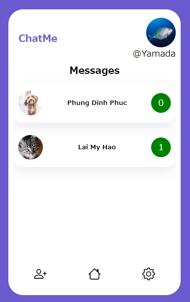

# django-chatapp
これはDjangoで書かれたChatAppアプリケーションです。教育目的で使用されます。

# チャットアプリの概要
このチャットアプリケーションの主な焦点は、ユーザー同士がチャットできるようにすることです。
そのため、認証システムは追加しておらず、ユーザーはDjango管理者から作成され、ログインします。

このアプリケーションのインデックスページにアクセスする前に、ユーザーがログインしている必要があります。
そうでない場合、DjangoからAnonymousUserErrorが発生します。

# スクリーンショット
メイン画面

チャット画面　ユーザー1

チャット画面　ユーザー2

